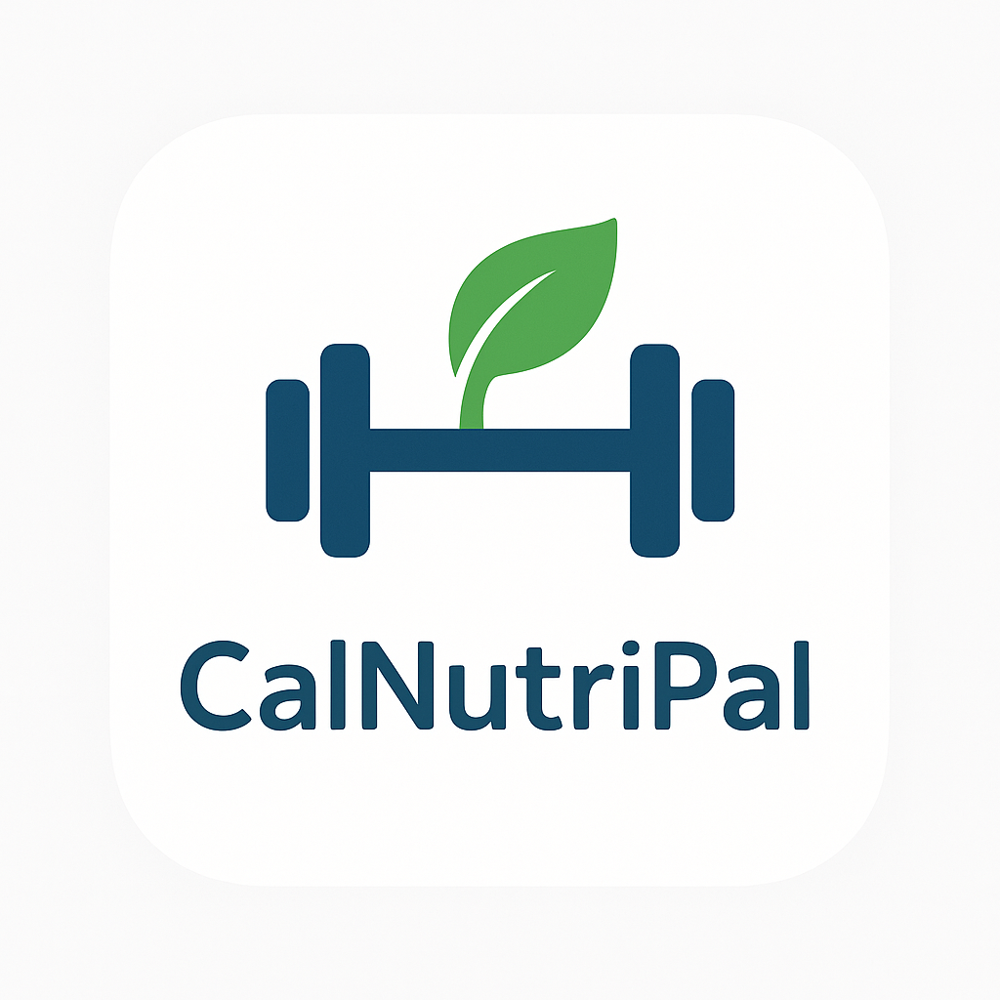

# CalNutriPal

A modern mobile application to track daily nutrition, calories, and health goals. Built with Flutter and Firebase, CalNutriPal helps you monitor your food intake, set personalized goals, and gain insights into your nutrition journey.



---

## Table of Contents

- [Features](#features)
- [Screenshots](#screenshots)
- [Getting Started](#getting-started)
  - [Prerequisites](#prerequisites)
  - [Installation](#installation)
  - [Firebase Setup](#firebase-setup)
- [App Structure & Architecture](#app-structure--architecture)
- [Usage Guide](#usage-guide)
  - [Onboarding](#onboarding)
  - [Main Features](#main-features)
- [Configuration & Customization](#configuration--customization)
- [Testing & Development](#testing--development)
- [Troubleshooting & FAQ](#troubleshooting--faq)
- [Contributing](#contributing)
- [License](#license)
- [Contact & Support](#contact--support)

---

## Features

- Track daily food intake and nutrition
- Monitor calorie goals and macronutrient distribution
- Personalized profile with body stats and progress tracking
- Dashboard with nutrition insights and summaries
- Reports and analytics for your health journey
- Onboarding flow for personalized recommendations
- Offline support (local storage)
- Data privacy: reset and delete your data anytime

## Screenshots

<!-- Add screenshots in assets/images/screenshots/ and reference here -->
<!--  -->
<!--  -->

---

## Getting Started

### Prerequisites

- [Flutter SDK](https://flutter.dev/docs/get-started/install) (>=3.2.3 <4.0.0)
- Dart (compatible with your Flutter version)
- iOS or Android development environment (Xcode, Android Studio, or VS Code)
- [Firebase account](https://firebase.google.com/)

### Installation

1. **Clone the repository:**
   ```bash
   git clone <repo-url>
   cd CalNutriPal
   ```
2. **Install dependencies:**
   ```bash
   flutter pub get
   ```
3. **Configure Firebase:**
   - iOS: The project is pre-configured for iOS with `GoogleService-Info.plist` in `ios/Runner/`.
   - If you want to use your own Firebase project, replace the `GoogleService-Info.plist` and update `lib/firebase_options.dart` using the [FlutterFire CLI](https://firebase.flutter.dev/docs/cli/).
4. **Run the app:**
   ```bash
   flutter run
   ```
   - For iOS, ensure CocoaPods are installed: `cd ios && pod install && cd ..`

---

## Firebase Setup

- The app uses Firebase for analytics and (optionally) authentication and storage.
- Default configuration is for iOS. For Android or other platforms, run the FlutterFire CLI to generate the appropriate config files.
- Sensitive keys are managed in `GoogleService-Info.plist` and `lib/firebase_options.dart` (do not share these publicly).

---

## App Structure & Architecture

```
lib/
  core/         # Dependency injection, models, repositories, services
  features/     # Feature modules (auth, dashboard, goals, nutrition_log, profile, shared)
  shared/       # Theme, utils, widgets
```

- **State Management:** Provider
- **Dependency Injection:** get_it
- **Local Storage:** shared_preferences, sqflite
- **Networking:** http
- **Charts & UI:** fl_chart, percent_indicator, flutter_svg
- **Testing:** flutter_test, integration_test, mockito, golden_toolkit

---

## Usage Guide

### Onboarding

- On first launch, you'll see a splash screen and be guided through onboarding:
  1. **Body Stats:** Enter your height, weight, age, gender, and activity level.
  2. **Nutrition Goals:** Set your calorie and macronutrient targets (or use recommended values).
  3. **Privacy Terms:** Accept privacy terms to proceed.
- You can skip onboarding, but it's recommended for personalized tracking.

### Main Features

- **Dashboard:** View daily summary, progress, and insights.
- **Food Log:** Add meals, view nutrition breakdown, and track intake.
- **Profile:** Update stats, reset data, or delete your account.
- **Reports:** Visualize trends and analytics over time.

---

## Configuration & Customization

- **Assets:** Place images in `assets/images/` (see `pubspec.yaml`).
- **Launch Screen:** Customize iOS launch assets in `ios/Runner/Assets.xcassets/LaunchImage.imageset/`.
- **Firebase:** To use your own Firebase project, update `GoogleService-Info.plist` and regenerate `firebase_options.dart`.
- **App Theme:** Modify `lib/shared/theme/app_theme.dart` for custom colors and styles.

---

## Testing & Development

- **Unit & Widget Tests:**
  ```bash
  flutter test
  ```
- **Integration Tests:**
  ```bash
  flutter test integration_test
  ```
- **Golden Tests:** Visual regression testing with `golden_toolkit`.
- **Mocking:** Use `mockito` for service and repository mocks.
- **Hot Reload/Restart:** Use Flutter's hot reload for rapid development.

---

## Troubleshooting & FAQ

- **App won't start?**
  - Ensure all dependencies are installed (`flutter pub get`).
  - For iOS, run `pod install` in the `ios/` directory.
  - Check your Flutter and Dart versions.
- **Firebase errors?**
  - Make sure your `GoogleService-Info.plist` and `firebase_options.dart` are correct.
  - For new Firebase projects, use the FlutterFire CLI to generate config files.
- **Resetting Data:**
  - Go to Profile > Settings > Reset App Data to clear all local data and restart onboarding.
- **Deleting Account:**
  - Profile > Delete Account will remove all your data (local and remote, if implemented).
- **Offline Support:**
  - The app uses local storage and will sync when online (if cloud features are enabled).

---

## Contributing

We welcome contributions! To get started:

1. Fork this repository
2. Create a new branch (`git checkout -b feature/your-feature`)
3. Make your changes and add tests
4. Commit and push (`git commit -am 'Add new feature'`)
5. Open a Pull Request

Please follow the existing code style and add tests for new features.

---

## License

This project is proprietary and not licensed for public use.

---

## Contact & Support

- For questions, issues, or feature requests, please open an issue in this repository.
- For private support, contact the project maintainer.
